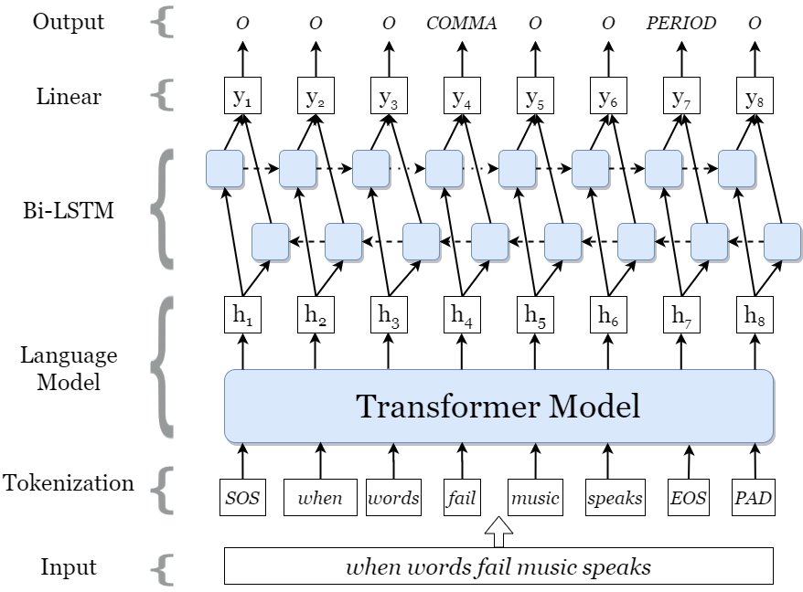

# Punctuation_prediction

Model for punctuation restoration in Polish language.


## Data

#### English
English datasets are provided in `data/en` directory. These are collected from [here](https://drive.google.com/file/d/0B13Cc1a7ebTuMElFWGlYcUlVZ0k/view).

#### Polish
Polish dataset was taken from [Poleval 2022](https://github.com/poleval/2022-punctuation-prediction) and [Poleval 2021 competition](https://github.com/poleval/2021-punctuation-restoration) and it's available in `data/raw` directory. The dataset was later processed with `dataset_creation.py` script to match the format of the English dataset and is stored in this format in `data/pl` directory.


## Model Architecture
Model was described in [*Punctuation Restoration using Transformer Models for High-and Low-Resource Languages* by Alam Tanvirul, Khan Akib  and Alam Firoj](https://aclanthology.org/2020.wnut-1.18/) and implemented [here](https://github.com/xashru/punctuation-restoration).


Transformer architecture based language model (e.g., BERT) was finetuned for the punctuation restoration task.
Transformer encoder is followed by a bidirectional LSTM and linear layer that predicts target punctuation token at
each sequence position.



## Dependencies
Install PyTorch following instructions from [PyTorch website](https://pytorch.org/get-started/locally/). Remaining
dependencies can be installed with the following command
```bash
pip install -r requirements.txt
```


## Training
To train punctuation restoration model with optimal parameter settings for English run the following command
```
python src/train.py --cuda=True --pretrained-model=bert-base-uncased --freeze-bert=False --lstm-dim=-1 
--language=english --seed=1 --lr=5e-6 --epoch=10 --use-crf=False --augment-type=all  --augment-rate=0.15 
--alpha-sub=0.4 --alpha-del=0.4 --data-path=data --save-path=out
```

For basic training of the model for Polish language run the following command
```
python src/train.py --pretrained-model=herbert-base --language=polish 
```

#### Supported models
`bert-base-uncased` for english
`herbert-base` for polish


## Pretrained Models
You can find pretrained mdoels for RoBERTa-large model with augmentation for English [here](https://drive.google.com/file/d/17BPcnHVhpQlsOTC8LEayIFFJ7WkL00cr/view?usp=sharing)  
XLM-RoBERTa-large model with augmentation for Bangla can be found [here](https://drive.google.com/file/d/1X2udyT1XYrmCNvWtFpT_6jrWsQejGCBW/view?usp=sharing)


## Inference
You can run inference on unprocessed text file to produce punctuated text using `inference` module. Note that if the 
text already contains punctuation they are removed before inference. 

Example script for Polish:
```bash
python src/inference.py --pretrained-model=herbert-base --weight-path=out/weights.pt --language=pl --in-file=data/test_pl.txt --out-file=data/test_pl_out.txt
```
This should create the text file with following output:
```text
Tolkien drew on a wide array of influences including language, Christianity, mythology, including the Norse Völsunga saga, archaeology, especially at the Temple of Nodens, ancient and modern literature and personal experience. He was inspired primarily by his profession, philology. his work centred on the study of Old English literature, especially Beowulf, and he acknowledged its importance to his writings. 
```

Please note that *Comma* includes commas, colons and dashes, *Period* includes full stops, exclamation marks 
and semicolons and *Question* is just question marks. 


## Test
Trained models can be tested on processed data using `test` module to prepare result.

For example, to test the best preforming English model run following command
```bash
python src/test.py --pretrained-model=roberta-large --lstm-dim=-1 --use-crf=False --data-path=data/test
--weight-path=weights/roberta-large-en.pt --sequence-length=256 --save-path=out
```
Please provide corresponding arguments for `pretrained-model`, `lstm-dim`, `use-crf` that were used during training the
model. This will run test for all data available in `data-path` directory.
